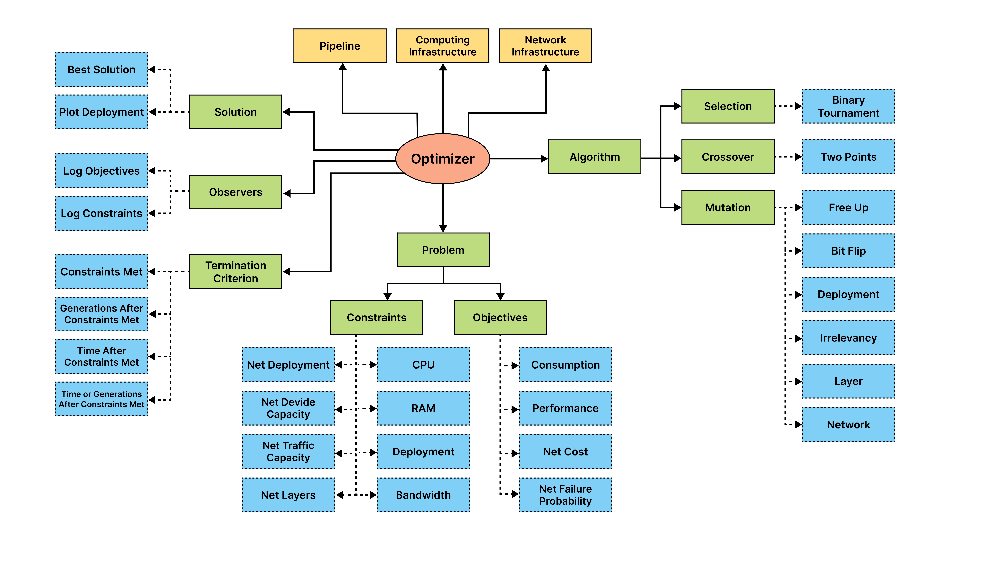
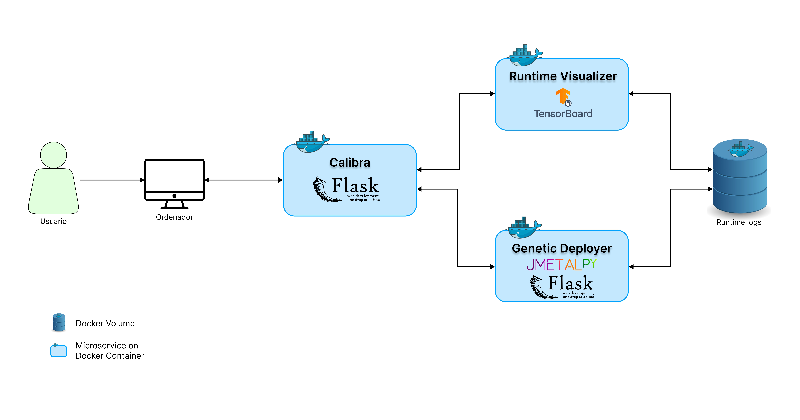

# Calibra: investigación y desarrollo de una herramienta AIOps para la planificación del despliegue de pipelines analíticos distribuidos

<div style="text-align: justify">
Este proyecto consiste en la investigación y desarrollo de un sistema capaz de planificar el despliegue de pipelines 
analíticos a lo largo de diferentes capas de computación, planteando la distribución óptima de los dispositivos de 
procesamiento y de red. Se describen una serie de restricciones que la planificación debe cumplir, además de varias 
funciones objetivo con las que cada una de las soluciones propuestas para el despliegue será evaluada. El sistema trata 
de optimizar la planificación basándose en el coste de la arquitectura desplegada, el rendimiento de los dispositivos
de procesamiento y la probabilidad de fallo de la arquitectura de red. También se tiene en cuenta la existencia de las 
diferentes capas de red como son el Edge o el Cloud, en las que se distribuyen los diferentes dispositivos de 
computación y de red.
</div>


[Video de demostración en buena calidad](https://drive.google.com/file/d/1Ohp1PAbcnZkmtzKsVWGKfZAcz2_mXuN7/preview)

## 1. Como ejecutar Calibra
### 1.1 Versión Web + API
* Instalar [Docker](https://www.docker.com) en el sistema.
* Abrir un terminal y ubicarnos en el directorio principal de este proyecto (juntó este README).
* Ejecutar el siguiente comando:
```
docker-compose up
```
#### Para acceder a la interfaz gráfica principal del servidor Calibra, introducir la siguiente ruta en un navegador web:
[http://127.0.0.1:7070/optimize_deployment](http://127.0.0.1:7070/optimize_deployment)
#### Para acceder a la API del servidor Genetic Deployer, introducir la siguiente ruta en un navegador web:
[http://127.0.0.1:8080/ui](http://127.0.0.1:8080/ui)

### 1.2 Versión CLI
* Abrir un terminal y ubicarnos en el directorio principal de este proyecto (juntó este README).
* Para lanzar el pipeline de 20 modelos (`src/resorces/pipeline_20NET.yml`), ejecutar los siguientes comandos:
```
pip install -r requirements.txt
python run.py -c 20NET
```
* Para inicializar tensorboard, ejecutamos el siguiente comando en una terminal:
```
tensorboard --logdir logs
```
* Para modificar los ficheros de infraestructura de cómputo o de red a utilizar, editar el fichero 
`src/core/constants.py`.

## 2. Ficheros de ejemplo
La estructura que deben seguir los ficheros facilitados a la herramienta deben seguir el mismo formato que los ficheros 
ubicados dentro del directorio `src/resources` del proyecto.


## 3. Arquitectura de alto nivel de los componentes



## 4. Arquitectura de los microservicios web



